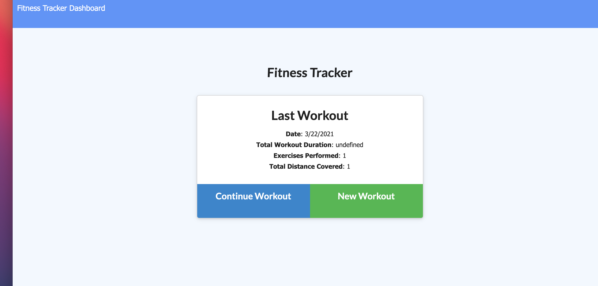

# Fitness-Tracker

## Description
The project is a full-stack web application of a Fitness Tracker .
## Table of Contents
* [Usage](#usage)
* [Screenshots](#screenshots)
* [Technologies-used](#technologies-used)

## Usage
The fitness tracker allows the user to continue a workout or create a new one. For a new workout the user will start be choosing the exercise type which are cardio or resistance. Resistance and cardio track different deatils about the workout. Once the user is done they can either add another exercise to their workout or complete. All the workouts will be save the dashboard which is on the top left hand corner.
## Technologies-used
Fitness tracker uses html/css and javascipt for the front-end as well as Node, Express and MongoDB for the database snd is deployed on heroku.

## Screenshots

